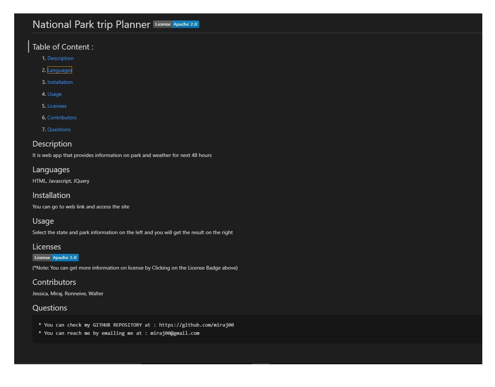

  # National Park

  ## Table of Content :

  1. [Description](https://github.com/miraj00/readme-generator#description-) 

  2. [Languages Used](https://github.com/miraj00/readme-generator#languages-used-)
  
  3. [How to Install](https://github.com/miraj00/readme-generator#how-to-install-)
  
  4. [How to use the application](https://github.com/miraj00/readme-generator#how-to-use-the-application-)
  
  5. [Licenses](https://github.com/miraj00/readme-generator#lincenses-)
  
  6. [Contributors](https://github.com/miraj00/readme-generator#lincenses-)
  
  7. [Questions / Reach Me](https://github.com/miraj00/readme-generator#questions-)
  
 

  ## Description : 
  national park is API based application that shows realtime data for campers and hikers
  
  ## Languages used : 
  HTML, ES6, Bootstrap
  
  ## How to Install :
  dfffffffffffffff
  
  ## How to use the application :
  use it before travel and during travel

  ## Screenshot of the Project :
  
  
  ## Lincenses :  
  
     
  ## Contributors :
  miraj, ronnie, jessica, walter
  
  ## Questions :
    * You can check my Github Repository at : [Github](https://github.com/miraj00)  
    * You can reach me by emailing me at : miraj00@gmail.com
  
  
