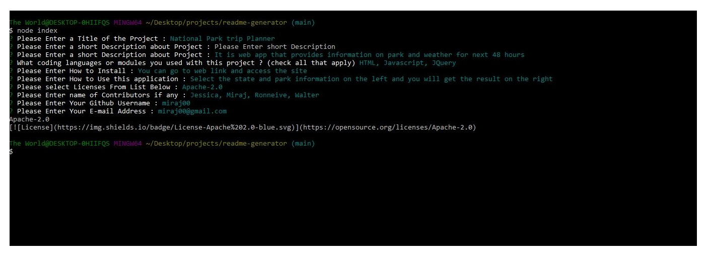

# README Generator

As a developer, I wanted to create README generator that can create Professional README file.

* Minimum requirements to create this project is as follow  : 

1. Command line application would take user input by asking series of questions.
1. It should ask for title of the project, description, installation, allows to select license if any, contributors and contact information. 
1. Badge for the license is added near the top of README. 
1. Github username should be added to README entitled Questions with a link to github profile. 
1. Entered E-mail adress should be added to README entitled Questions. 
1. Upon clicking the Table of Contents, it should take user to corresponding section of README. 

Below is the information on outcome of the project.

## Description :
README Generator is node.js based application. It works by asking series of questions to the user on command prompt and prints dynamic output of readme file. It uses Node.js's inquirer package  
 
## Languages and other components used : 
   * Node.js 
   * FS (File systems) 
   * npm (node package manager) 
   * inquirer package
  
## How to install : 
 
 To install the application in your computer follow the steps below: 
 
 1. Clone the repository in your computer :
    - open the command line and go to the directory where you want to clone the repository.
    - then clone the repo by typing : "git clone git@github.com:miraj00/readme-generator.git"

 2. Install node.js on your computer by going to https://nodejs.org/en/  

 3. Once node.js is installed, type "npm init" on the cammand line Terminal at root directory.
    - This will initiate npm packages

 4. Install inquirer package by typing : "npm install inquirer" on the command line
    - you don't have to answer all the question and can skip by pressing enter till end.
    
 5. Once above steps are done, the application is ready to use.

## How to use application : 
You can use this application to generate README file. Once you follow the installation process as described above, go to command line and enter ' node index.js ' and it will go thru questionairie that will require input about your project. Upon finishing that questionairie it will generate readme file in ' dist folder '. To add screenshot in your project, create JPG file with the file name 'screenshot.JPG' and add in 'dist folder' along with README file. 
  

## Demo of how to install, answers Questionairre and Use the output of README file :
https://user-images.githubusercontent.com/84084583/129611189-108919e1-a2ee-4906-9be3-46127401e93e.mp4

## Screenshot of the Project :

#### Screenshot of command-line Questionairies :

 

#### Screenshot of README file deployed after answering questions :

 

  
## Link of Github Repository : [ Click here for GITHUB Link ](https://github.com/miraj00/readme-generator)  
  

  
  
