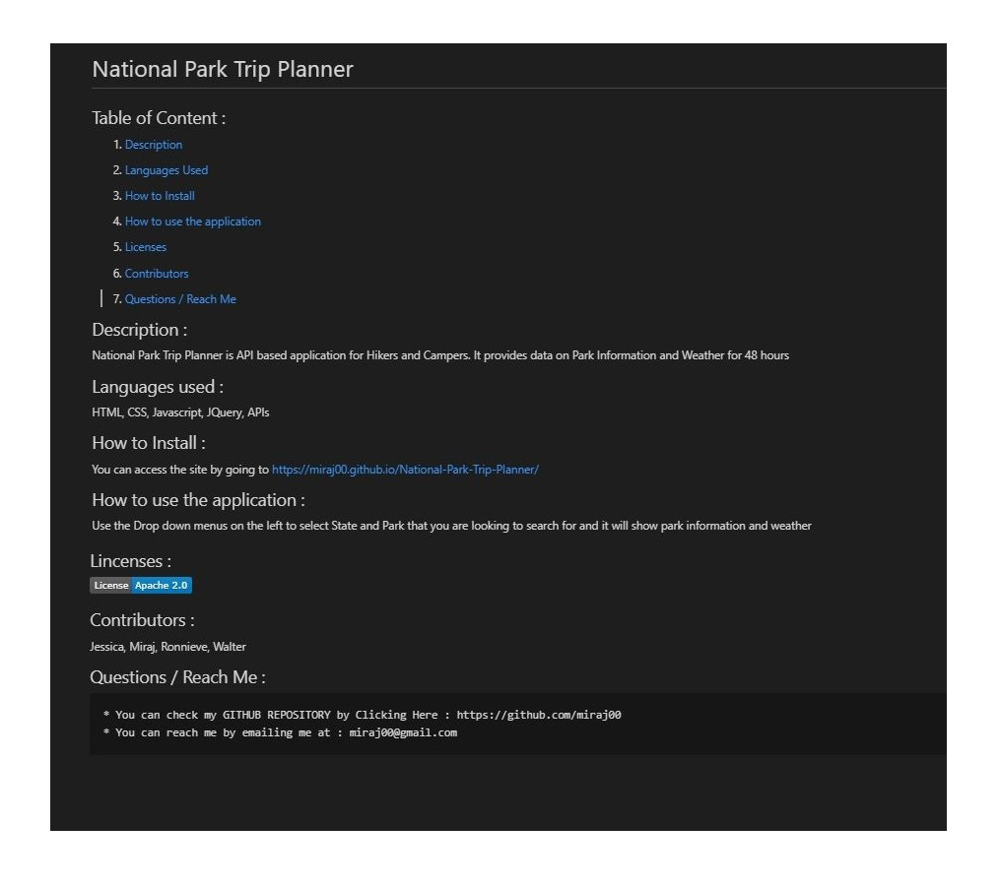

  # hiiii       

  ## Table of Content :

  1. [Description](https://github.com/miraj00/readme-generator#description-) 

  2. [Languages Used](https://github.com/miraj00/readme-generator#languages-used-)
  
  3. [How to Install](https://github.com/miraj00/readme-generator#how-to-install-)
  
  4. [How to use the application](https://github.com/miraj00/readme-generator#how-to-use-the-application-)
  
  5. [Licenses](https://github.com/miraj00/readme-generator#lincenses-)
  
  6. [Contributors](https://github.com/miraj00/readme-generator#lincenses-)
  
  7. [Questions / Reach Me](https://github.com/miraj00/readme-generator#questions-)
  
 

  ## Description : 
  xddddd
  
  ## Languages used : 
  HTML, Javascript
  
  ## How to Install :
  ddddd
  
  ## How to use the application :
  dsddddd

  ## Screenshot of the Project :
  
  
  ## Lincenses :  
  
     
  ## Contributors :
  dddddddddddd dddddd
  
  ## Questions / Reach Me :
    * You can check my GITHUB REPOSITORY by Clicking Here : https://github.com/ddddd  
    * You can reach me by emailing me at : dddddddd
  
  
